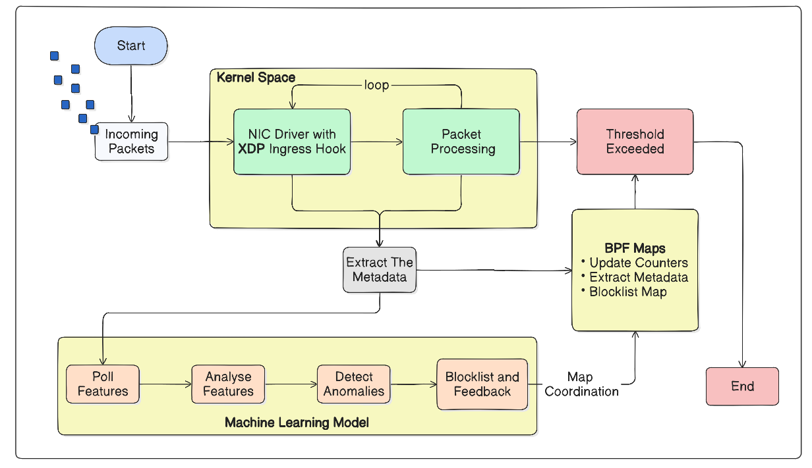

# Kernel-Level DNS Attack Mitigation Using an Intelligent XDP-Based Firewall

## Overview

This project presents a high-performance kernel-level firewall designed to detect and mitigate DNS-based Distributed Denial of Service (DDoS) attacks using XDP (eXpress Data Path) and Machine Learning techniques. The system operates at the Linux kernel level to achieve ultra-low latency packet filtering and real-time traffic analysis.

The firewall leverages eBPF/XDP programs for early packet processing, enabling malicious traffic to be detected and dropped before reaching the network stack. Additionally, a Machine Learning-based analysis module enhances attack detection accuracy by identifying abnormal traffic patterns and suspicious DNS behavior.

The project focuses on improving:

* DNS attack mitigation speed
* Real-time packet filtering efficiency
* Network throughput
* Intelligent traffic classification

---

# Features

* High-speed packet filtering using XDP/eBPF
* Kernel-level DNS attack mitigation
* Real-time malicious traffic detection
* Intelligent ML-based attack classification
* Benchmarking using iperf3
* Runtime monitoring and logging
* Low-latency packet processing
* Scalable architecture for high traffic environments

---

# Technologies Used

## Networking & Kernel Technologies

* XDP (eXpress Data Path)
* eBPF
* libbpf
* iproute2

## Programming Languages

* C
* Python
* Bash

## Machine Learning

* Scikit-learn
* Pandas
* NumPy

## Benchmarking & Monitoring

* iperf3
* psutil

---
## System Architecture Diagram

<p align="center">
  
</p>


# Project Workflow

1. Incoming packets are intercepted at the XDP layer.
2. DNS traffic is analyzed using predefined filtering rules.
3. Suspicious traffic patterns are forwarded to the ML module.
4. The ML model classifies traffic as benign or malicious.
5. Malicious packets are dropped at kernel level.
6. Runtime statistics and logs are continuously monitored.

---
# Installation

All environment setup scripts, dependency installation steps, and configuration files are available inside the setting-up-project/ directory.

# Benchmarking

Traffic generation and benchmarking were performed using iperf3.

## Start Server

```bash
iperf3 -s
```

## Generate UDP Traffic

```bash
iperf3 -c <server-ip> -u -b 50M -t 20
```

---

# Performance Metrics

The project evaluates:

* Packet Processing Rate (PPS)
* Throughput
* CPU Utilization
* Detection Accuracy
* Latency
* Packet Drop Efficiency

---

# Machine Learning Analysis

The ML module classifies traffic into:

* Benign Traffic
* Attack Traffic

Features analyzed include:

* Packet rate
* Byte rate
* DNS query frequency
* Traffic bursts
* Flow statistics

---

# Experimental Results

The XDP-based firewall demonstrated:

* Faster packet filtering compared to traditional firewalls
* Reduced CPU overhead
* Improved attack mitigation latency
* Efficient DNS attack handling under high traffic conditions

---

# Applications

* Enterprise Network Security
* DNS Infrastructure Protection
* DDoS Mitigation Systems
* High-Speed Packet Filtering
* Real-Time Threat Detection

---

# Future Enhancements

* Support for additional attack vectors
* Deep Learning-based detection
* Real-time visualization dashboard
* Adaptive firewall rule generation

---

# Contributors

* Akshata Yangunde
* Alfiya Fatima
* Avantika Kesarwani
* Bhavana S
---

# Acknowledgements
We express our sincere gratitude to our guide and faculty members for their support and guidance throughout the project.

---

# License
This project is developed for academic and research purposes.
